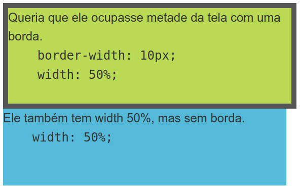
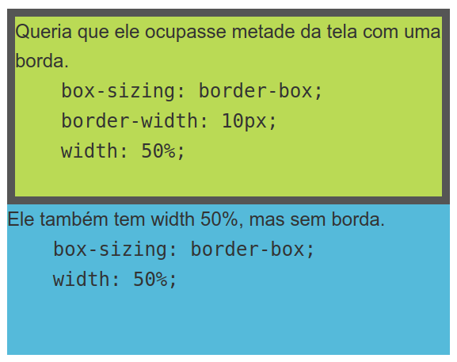
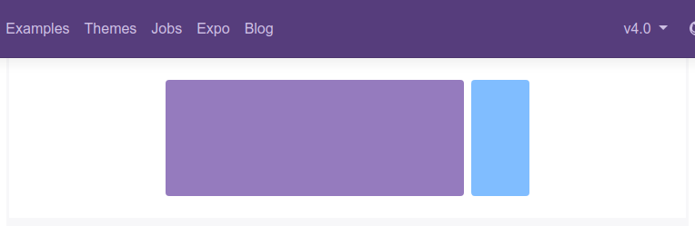
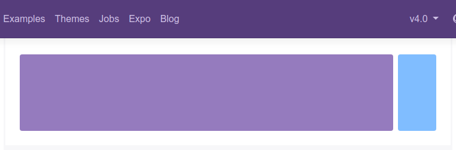

# Bootstrap 4 - Por dentro do Bootstrap

## Requerimentos e mudanças:

**É requerido:**

### HTML 5 Doctype

```
<!DOCTYPE html>
<html lang="en">
  ...
</html>
```

### Meta tag responsiva

```
<meta name="viewport" content="width=device-width, initial-scale=1, shrink-to-fit=no">
```

**Mudanças**

## Tecnologias e decisões

**<span style='color: red;'>Removido suporte ao IE8 e IE9, assim como browsers antigos</span>**.
 - <span style='color: red;'>Se precisar de suporte para IE8/IE9, iOS 8-, etc, continue usando o Bootstrap 3.</span>

**<span style='color: #523bf5;'>Movido de LESS para SASS</span>**: Agora o Bootstrap compila muito mais rápido e possui mais suporte pela comunidade SASS.

**<span style='color: #523bf5;'>Plugins JavaScript reescritos</span>**: Todos os scripts foram `reescritos em ES6` para tomar vantagem das novas melhorias do JavaScript.
 - `tooltips, popovers e dropdowns` possuem uma biblioteca específica para melhor suporte: [Popper.js](https://popper.js.org/)

**<span style='color: #523bf5;'>Ambiente de desenvolvimento reescrito</span>**: Completamente `reescrito em scripts NPM ao invés do Grunt`, simplificando o processo de desenvolvimento e contribuição.

**<span style='color: #523bf5;'>Uso de Flexbox e melhorias no sistema de grid</span>**: Agora o Bootstrap é construído por padrão, em flexbox, com um grid melhor adaptado para dispositivos mobiles.

**Removido wells, thumbnails e panels para cards.**: Agora os `Cards` são um novo componente no Bootstrap com personalizações melhoradas.

**Normalize.css foi 'forcado' e agora é um novo módulo no Bootstrap, o Reboot**: com adições do tipo `box-sizing: border-box` e personalizações de margem para componentes, agora um único arquivo possui o reset do Bootstrap.

**Novas opções de personalização de marca**: é possível agora habilitar/desabilitar cantos arredondados, transições, sombras...

## CSS

### Reboot

Para melhor experiência cross-browser, o Bootstrap 4 usa `resetou` valores de propriedades para corrigir inconsistência entre os navegadores e dispositivos.

Entre as mudanças:

**Defaults das páginas**

- Troca de `px` ou `em` para `rem`, para melhor escalabilidade entre devices.
- Uso de `rem` para margens, também com o foco na escalabilidade entre devices.
- Uso de `border-box` na propriedade `box-sizing`, para garantir que o tamanho definido de um elemento não exceda ao que foi definido devido a `padding` ou `border` definidos à aquele objeto.
- Não foi definido `font-size` para `<html>`. Mas `font-size: 1rem` é aplicado em `<body>` .
- A `<body>` possui agora `font-family` e `line-height` com valores padrões, para evitar problemas de inconsistência.
- Por segurança, `<body>` tem a cor de fundo `#fff`
- `margin-top` foi removido de uma série de elementos em detrimento a `margin-bottom`.

### Box-sizing

Para melhor dimensionamento do CSS, o Bootstrap 4 agora mudou o valor da propriedade `box-sizing` de `content-box` para `border-box`.

O que significa?

**CONTENT-BOX**



**BORDER-BOX**



*Referência:* [CSS: Você deveria usar box-sizing: border-box em todas as suas páginas](http://sergiolopes.org/css-box-sizing-border-box/)

  Por padrão, todos os elementos têm o valor  `box-sizing: content-box` o que indica que `o tamanho dele é definido pelo seu conteúdo apenas`. Mas podemos trocar por  `box-sizing: border-box` que indica que `o tamanho agora levará em conta até a borda -- ou seja, o width será a soma do conteúdo com a borda e o padding`.

Por isso, algumas outras aplicações de terceiros podem ter complicações em sua renderização. Fazendo-se necessário sobrescrever a regra do Bootstrap para que volte a funcionar corretamente. Algo do tipo:

```
.selector-for-some-widget {
  box-sizing: content-box;
}
```

### Containers

Para o uso do sistema de grid do Bootstrap, é necessário utilizar da classe `container`.



Para um layout com o tamanho máximo do viewport, é necessário o uso da classe `container-fluid`.



### Responsividade

**Mudanças**

* A colunagem com a classe **<span style='color: red;'>xs</span>** foi removida, pois o Bootstrap 4 foi construído com a metodologia *mobile first*, sendo assim, toda construção deve começar do menor device oara o maior.
* A classe **<span style='color: red;'>pull</span>** foi renomeada para **<span style='color: #523bf5;'>float</span>**.

**Breakpoints**

**Medidas dos breakpoints**

**Medidas maiores ou iguals ao breakpoint**

```
// Extra small devices (portrait phones, less than 576px)
// No media query since this is the default in Bootstrap

// Small devices (landscape phones, 576px and up)
@media (min-width: 576px) { ... }

// Medium devices (tablets, 768px and up)
@media (min-width: 768px) { ... }

// Large devices (desktops, 992px and up)
@media (min-width: 992px) { ... }

// Extra large devices (large desktops, 1200px and up)
@media (min-width: 1200px) { ... }
```

**Mixins**

```
@include media-breakpoint-up(xs) { ... }
@include media-breakpoint-up(sm) { ... }
@include media-breakpoint-up(md) { ... }
@include media-breakpoint-up(lg) { ... }
@include media-breakpoint-up(xl) { ... }

// Example usage:
@include media-breakpoint-up(sm) {
  .some-class {
    display: block;
  }
}
```

**Medidas menores ou iguals ao breakpoint**

```
// Extra small devices (portrait phones, less than 576px)
@media (max-width: 575px) { ... }

// Small devices (landscape phones, less than 768px)
@media (max-width: 767px) { ... }

// Medium devices (tablets, less than 992px)
@media (max-width: 991px) { ... }

// Large devices (desktops, less than 1200px)
@media (max-width: 1199px) { ... }

// Extra large devices (large desktops)
// No media query since the extra-large breakpoint has no upper bound on its width
```

**Mixins**

```
@include media-breakpoint-down(xs) { ... }
@include media-breakpoint-down(sm) { ... }
@include media-breakpoint-down(md) { ... }
@include media-breakpoint-down(lg) { ... }
```

**Medidas entre breakpoints**

```
// Extra small devices (portrait phones, less than 576px)
@media (max-width: 575px) { ... }

// Small devices (landscape phones, 576px and up)
@media (min-width: 576px) and (max-width: 767px) { ... }

// Medium devices (tablets, 768px and up)
@media (min-width: 768px) and (max-width: 991px) { ... }

// Large devices (desktops, 992px and up)
@media (min-width: 992px) and (max-width: 1199px) { ... }

// Extra large devices (large desktops, 1200px and up)
@media (min-width: 1200px) { ... }
```

**Mixins**

```
@include media-breakpoint-only(xs) { ... }
@include media-breakpoint-only(sm) { ... }
@include media-breakpoint-only(md) { ... }
@include media-breakpoint-only(lg) { ... }
@include media-breakpoint-only(xl) { ... }
```

### Grid

[Saiba mais em colunagem](https://getbootstrap.com/docs/4.0/layout/grid/)

### Stack de fonte nativa

As web fontes **Helvetica Neue, Helvetica e Arial** foram removidas no Bootstrap 4 e trocadas pela stack de fonte nativa. Saiba mais em [Using UI System Fonts In Web Design: A Quick Practical Guide](https://www.smashingmagazine.com/2015/11/using-system-ui-fonts-practical-guide/).

**O que isso significa?**

Fontes que remetem quase ao mesmo estilo visual e que já estão presentes nos sistemas.

Isso:

```
$font-family-sans-serif:
  // Safari for OS X and iOS (San Francisco)
  -apple-system,
  // Chrome >= 56 for OS X (San Francisco), Windows, Linux and Android
  system-ui,
  // Chrome < 56 for OS X (San Francisco)
  BlinkMacSystemFont,
  // Windows
  "Segoe UI",
  // Android
  "Roboto",
  // Basic web fallback
  "Helvetica Neue", Arial, sans-serif !default;
```

Gera isso:


### Utilitários

[Flex](https://getbootstrap.com/docs/4.0/utilities/flex/)

### Extensões

Sugestões de itens externos para utilizar com o bootstrap:

[Ícones](https://getbootstrap.com/docs/4.0/extend/icons/) 
